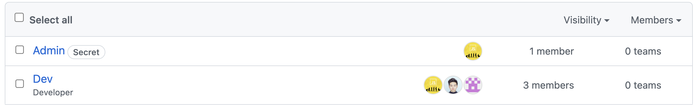
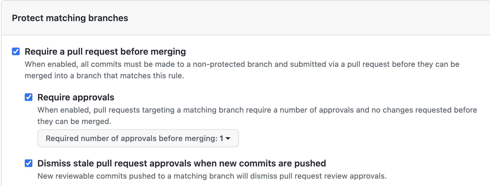
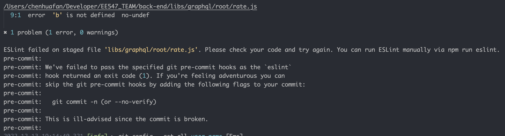
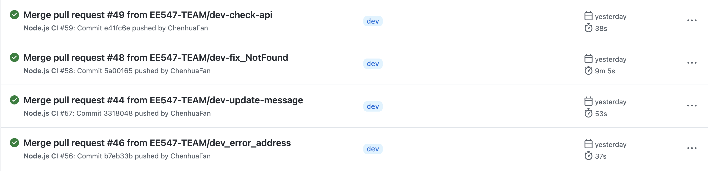

EE 547 Applied and Cloud Computing Final Report

# Title:

    Face2Face - a trading platform for used goods

# Team members:

    Chenhua Fan, Qiwei Chen, PingChen Chang

# Summary and Description

    In this project, we pay more attention on backend development(Git & CICD). We built a platform for used goods trading. By searching the name of goods people want to purchase, We will provide a map showing related products within a certain distance nearby. This can give us a very intuitive feeling and know what to buy nearby. As a buyer, we can also click into a seller's grocery and check if there is something we are inserted in. By providing a "Rating System", we can know how credible a person is as a buyer/seller, and this will help us select the person we want to trade with.we don't directly display user's contact information for privacy, however, we offer a chatting system in which people can communicate with each other, and this can improve the efficiency when we are selecting goods.

# Install and Run

    npm i
    npm run dev

# GuideLine

    libs\graphql\root
        Under this path includes functions for checking if the input data is in correct format and used the check isValid function in utils\validation.js
        add path in index js for export to routes\graphql\index.js.

    libs\mongo
        Under this path includes functions that fulfill api's function by using find or findone to find data in Mongodb.By using save to save data in Mongodb.
        add path in index.js for export to

    utils\validation.js
        This js contains validaiton check fuctions.
        Functions are used in libs\graphql\root.

# Development

First, we use the Github organization to help us manage our project progress, front-end/back-end repos,  actions (CI/CD), team role and permission.

Before we start the project, we add strict git branch restrictions, and Airbnb coding style to guarantee the consistency of style and quality of codes. Meanwhile, by adding a reviewer to the pull request, we can prevent disruptive updates. When we are coding, the Eslint will check automatically if our code meets the rules. Also when we save the file, Eslint will change all coding that doesn't fit the rules.

### Team

* Admin Team: All permission
* Dev Team: modify only

  

### Git Branch Policy

`Dev` is the protected branch. Blow is the policies applied for this branch.

`Eslint` style check before commit (git precommit hook).

`.github/hooks/eslint.sh` is the eslint pre-commit scripts.

### Workflow

Our Action workflow is test, compile and development. After we commit our change, push commits to remote git repo and create a pull request on Github. The pull request will ask a reviewer to make sure if anything will affect the dev branch. Reviewer can reject the request or approve. After the reviewer approves the request then the authorized account (watcher) can merge the code into the development branch, which triggers an automatic deployment job.

`.github/workflows/backend_deployment.yml` is the auto deployment workflow script.

# Backend

###### MongoDB - Mongoose - GraphQL - ExpressJS

    In the project, we use Mongoose for object mapping and Graphql for API implementation. We use Mongoose to create Documents from Schema then save it into Mongodb. Each folder contains its Model which supports MongoDB operations.

    For Instances, Address schema includes _id, content, userId, is_default. Graphql will request data from Mongoose and get data from MongoDB. The flow is User (client ) will ask or save data, next is integrate. With integrate, it can get data directly from session and graphql. Graphql can ask or get data from Mongoose. Mongoose can save the data in the format we need or get data from MongoDB.
